# Implementation Plan - Context-Aware Proposal LTR Scorer

## 1. Mục tiêu

Cải tiến `ProposalLTRScorer` từ một MLP chấm từng proposal độc lập thành một bộ xếp hạng theo tập (set/list) có khả năng:

- cho mỗi proposal nhìn thấy các proposal khác trong cùng video;
- không phụ thuộc vào thứ tự proposal được đưa vào model;
- xử lý số proposal thay đổi theo video;
- tận dụng thứ hạng ban đầu từ ActionFormer như một tín hiệu re-ranking có kiểm soát;
- tiếp tục huấn luyện theo pairwise, mặc định dùng RankNet logistic weighted theo chênh lệch utility; LambdaRank/NDCG weighting là ablation tập trung vào top-k;
- giữ nguyên legacy LTR và scorer hiện tại làm baseline/fallback;
- lưu đầy đủ log, cấu hình và checkpoint để tái lập thí nghiệm và viết báo cáo.

Không thay đổi pipeline production mặc định trong giai đoạn triển khai. Không commit hoặc push trong phạm vi plan này.

## 2. Căn cứ từ hai bài báo

### 2.1 SetRank

Các ý áp dụng trực tiếp:

- Scoring phải là hàm đa biến: score của một proposal phụ thuộc vào toàn bộ tập proposal cùng video.
- Dùng stacked Induced Multi-head Self-Attention Block (IMSAB) làm contextual encoder chính.
- Không dùng positional encoding theo vị trí tensor trong chế độ ranking thuần, nhờ đó scorer có tính permutation-equivariant; sau khi sort score, kết quả ranking có tính permutation-invariant.
- Dùng inducing points để giảm chi phí từ `O(N^2)` của MSAB xuống gần `O(NM)` và tăng độ ổn định khi số proposal lúc train/test khác nhau.
- Nếu có một weak/base ranker, mã hóa thứ hạng ban đầu bằng ordinal/rank embedding gắn với từng item, không dùng thứ tự mảng ngẫu nhiên.
- Có thể dùng loss ranking khác nhau với set encoder; trong project này vẫn giữ pairwise để tương thích nhãn utility và pipeline hiện tại.

### 2.2 Context-Aware Learning to Rank with Self-Attention

Các ý áp dụng trực tiếp:

- Kiến trúc gồm shared input projection, nhiều Transformer encoder block, rồi shared scalar head.
- Mỗi block cần residual connection, LayerNorm, feed-forward và dropout.
- Context-aware architecture có thể dùng với pointwise, pairwise hoặc listwise loss; vì vậy cần tách scorer và loss để ablation độc lập.
- Với bài toán re-ranking, positional/ordinal signal từ base ranker có thể hữu ích.
- Dùng kết quả so sánh loss của bài báo làm căn cứ thử RankNet và LambdaRank/NDCG-weighted RankNet, nhưng không chuyển pipeline sang listwise.
- Self-attention có chi phí bậc hai, nên chỉ áp dụng cho shortlist và đo latency theo list length.

### 2.3 Điều chỉnh cho dữ liệu hiện tại

Hai bài báo dùng dữ liệu LTR rất lớn, trong khi fold hiện tại chỉ có 18 video và 66 highlight. Vì vậy không sao chép cấu hình 4-6 encoder block, 256-1024 hidden units của bài báo. Bản đầu tiên phải nhỏ, có regularization mạnh và được đánh giá bằng cross-validation theo video.

## 3. Baseline và vấn đề hiện tại

Luồng hiện tại:

```text
ActionFormer features
  -> GT + fixed-grid proposals khi train LTR
  -> ProposalContextPooler (inside/left/right + confidence + duration)
  -> MLP dùng chung cho từng proposal
  -> margin pairwise loss trong cùng video
  -> sigmoid(score)
  -> Soft-NMS và top-k
```

Các khoảng trống cần xử lý:

1. MLP không trao đổi thông tin giữa các proposal; left/right temporal pooling không thay thế proposal-level interaction.
2. Tensor proposal bị flatten trước scoring nên model không còn cấu trúc list và padding mask.
3. Train chủ yếu trên GT + grid proposal, nhưng inference chấm proposal do ActionFormer sinh ra; đây là distribution shift.
4. Margin loss coi các pair gần như đồng đều và không tập trung đủ vào thứ hạng top 1/3/5.
5. Pairwise hinge hiện tại gán trọng số gần như đồng đều cho các pair, nên lỗi đảo hạng ở đầu danh sách chưa được ưu tiên đúng mức.
6. Checkpoint chỉ lưu state dict của scorer; cấu hình kiến trúc chưa đủ để dựng đúng các biến thể mới.
7. Evaluation nội bộ chỉ có nDCG@3 trên training proposal, chưa đo đầy đủ ranking quality trên predicted proposal.

Baseline bắt buộc phải được đóng băng trước khi thay đổi:

- B0: ActionFormer confidence, không LTR.
- B1: MLP proposal scorer + margin pairwise hiện tại.
- B2: MLP hiện tại + utility-weighted RankNet, để tách tác động của loss khỏi tác động của self-attention.

## 4. Kiến trúc đích

### 4.0a Training flow

```mermaid
flowchart LR
    CACHE["Training feature cache<br/>7 x T @ 10 Hz"] --> AF["Frozen ActionFormer"]
    AF --> FM["Temporal feature map"]
    AF --> CAND["Candidate proposals<br/>OOF predicted + GT jitter<br/>+ hard negatives"]

    ANN["Training annotations<br/>importance + highlight boundaries"] --> UTIL["Utility v2<br/>mỗi proposal một nhãn u"]
    CAND --> UTIL

    FM --> POOL["Proposal pooling<br/>inside + left + right"]
    CAND --> POOL
    CAND --> META["Proposal metadata<br/>confidence, duration,<br/>start, end, center"]

    POOL --> PACK["Pack list theo video<br/>B x Nmax x Din + mask"]
    META --> PACK
    CAND --> ORD["ActionFormer ordinal rank<br/>optional embedding"]

    PACK --> PROJ["Shared projection<br/>Linear + GELU + LayerNorm"]
    PROJ --> ADD["Proposal tokens X0"]
    ORD --> ADD

    ADD --> IMSAB1["IMSAB block 1<br/>N → M=16 → N"]
    IMSAB1 --> IMSAB2["IMSAB block 2<br/>N → M=16 → N"]
    IMSAB2 --> HEAD["Shared scalar head<br/>128 → 1"]
    HEAD --> SCORE["Proposal scores s"]

    UTIL --> PAIR["Within-video pair sampler<br/>u_i > u_j + utility_delta"]
    SCORE --> PAIR
    PAIR --> WEIGHT["Tính w_ij = |u_i-u_j|"]
    WEIGHT --> LOSS["Utility-weighted RankNet<br/>w_ij × softplus(-(s_i-s_j))"]
    LOSS --> UPDATE["Backpropagation<br/>cập nhật pooler + IMSAB + head"]
    UPDATE --> ART["Best/last checkpoint<br/>JSON + CSV + curves"]
```



Trong training, annotation chỉ đi vào nhánh tạo `utility` và pairwise loss. ActionFormer được đóng băng; gradient dừng ở temporal feature map và chỉ cập nhật proposal pooler, ordinal embedding, hai IMSAB block cùng scalar head.

### 4.0b Inference flow

```mermaid
flowchart LR
    VIDEO["Video URL hoặc file local"] --> CACHE["Feature extraction/cache<br/>7 x T @ 10 Hz"]
    CACHE --> AF["ActionFormer checkpoint"]
    AF --> FM["Temporal feature map"]
    AF --> DECODE["Decode candidate proposals<br/>start, end, confidence, level"]

    FM --> POOL["Proposal pooling<br/>inside + left + right"]
    DECODE --> POOL
    DECODE --> META["Proposal metadata<br/>confidence, duration,<br/>start, end, center"]

    POOL --> PACK["Pack một video<br/>1 x N x Din + valid mask"]
    META --> PACK
    DECODE --> ORD["ActionFormer ordinal rank<br/>nếu checkpoint yêu cầu"]

    PACK --> PROJ["Shared projection"]
    PROJ --> ADD["Proposal tokens X0"]
    ORD --> ADD
    ADD --> IMSAB1["IMSAB block 1<br/>N → M=16 → N"]
    IMSAB1 --> IMSAB2["IMSAB block 2<br/>N → M=16 → N"]
    IMSAB2 --> HEAD["Shared scalar head"]
    HEAD --> SCORE["Raw LTR scores<br/>một score/proposal"]
    SCORE --> ATTACH["Gắn rank_score<br/>vào proposal tương ứng"]
    ATTACH --> NMS["Soft-NMS<br/>giảm proposal trùng lặp"]
    NMS --> TOPK["Top-k highlights<br/>start, end, final score"]
```



Inference không đọc annotation, không tạo pair và không tính loss. Tất cả tham số ActionFormer, pooling và IMSAB được load từ checkpoint rồi chạy ở `eval/no_grad` mode.

Luồng tensor chính:

```text
feature map                      : (B, C, T')
proposal list                    : B x variable(N_i)
pooled proposal representation  : (B, N_max, 3C + metadata_dim)
projected proposal tokens       : (B, N_max, d_model)
contextual proposal tokens      : (B, N_max, d_model)
ranking scores                  : (B, N_max)
training valid pair indices     : (num_pairs, 2), không có cross-video pair
training pair weights           : (num_pairs,), mặc định lấy từ abs(u_i-u_j)
```

Các ranh giới quan trọng:

- ActionFormer được freeze trong giai đoạn train scorer đầu tiên.
- IMSAB chỉ tổng hợp proposal của cùng một video; padding bị mask hoàn toàn khi inducing points đọc proposal tokens.
- Không dùng vị trí proposal trong tensor làm positional encoding.
- Ordinal embedding, nếu bật, được tính từ ActionFormer confidence và gắn với đúng proposal.
- Pair sampler, utility và loss chỉ tồn tại khi training; inference đi thẳng từ scalar score sang Soft-NMS.
- Không đưa ListNet/ListMLE hoặc listwise objective vào flow.

### 4.1 Proposal representation

Giữ `ProposalContextPooler`, nhưng tách thành hai bước:

1. Pool feature theo từng proposal.
2. Pack lại thành tensor `(B, N_max, D_in)` cùng `proposal_mask`.

Feature đầu vào cho mỗi proposal:

- attention-pooled feature bên trong proposal;
- mean-pooled left context;
- mean-pooled right context;
- ActionFormer confidence/logit;
- normalized duration;
- normalized start, end và center theo video duration;
- tùy chọn: proposal level, local index và boundary confidence nếu decoder cung cấp.

Các temporal scalar là thuộc tính gắn với proposal, không phải vị trí tensor, nên không làm mất permutation-equivariance.

Chuẩn hóa:

- LayerNorm trên vector proposal sau input projection;
- thống kê chuẩn hóa scalar phải được fit chỉ trên train split và ghi vào checkpoint;
- không fit lại trên val/test.

### 4.2 Contextual set encoder dùng IMSAB

Tạo `ContextAwareProposalLTRScorer`:

```text
proposal features (B, N, D_in)
  -> shared Linear(D_in, d_model) + GELU + LayerNorm
  -> optional base-rank ordinal embedding
  -> 2 x IMSAB với M learned inducing points
  -> shared Linear(d_model, 1)
  -> scores (B, N), masked ở vị trí padding
```

Mỗi IMSAB thực hiện hai phép attention:

```text
H = MAB(I, X, X)       # M inducing points đọc toàn bộ N proposal
X_next = MAB(X, H, H)  # N proposal đọc lại contextual summary từ M states
```

Trong đó `MAB` gồm masked multi-head attention, residual connection, LayerNorm, feed-forward network và dropout. Output vẫn có `N` token nên mỗi proposal nhận đúng một scalar score.

Cấu hình khởi đầu phù hợp dữ liệu nhỏ:

- `d_model=128`;
- `num_imsab_blocks=2`;
- `num_inducing_points=16`;
- `num_heads=2`;
- `ffn_dim=256`;
- `dropout=0.3`;
- activation `GELU`;
- attention mask bắt buộc cho padding;
- không có sequence positional encoding trong chế độ set ranking.

Giữ một interface tương thích trả `(flat_scores, provenance)` để inference cũ chưa cần đổi đồng loạt, nhưng nội bộ scorer phải làm việc trên `(B, N, D)`.

### 4.3 Base-rank ordinal embedding

Thêm hai mode:

- `rank_signal=none`: ranking thuần, không dùng rank ban đầu.
- `rank_signal=actionformer_ordinal`: sort tạm theo ActionFormer confidence, tính rank 1..N, lookup embedding rồi gắn embedding đó vào đúng proposal trước khi self-attention.

Không dùng index hiện tại trong list làm rank. Khi hoán vị input, rank signal phải đi theo proposal tương ứng.

Trong inference, ordinal embedding chỉ dùng ActionFormer score được tạo trước LTR, tuyệt đối không dùng label hoặc LTR score.

### 4.4 Chính sách inducing points và MSAB baseline

IMSAB là kiến trúc chính của MVP với `M=16`. Giá trị `M` là capacity và compute budget của contextual bottleneck:

- thử `M=8/16/32` trong ablation, mặc định `M=16`;
- giữ `M` cố định khi số proposal `N` thay đổi;
- nếu `N < M`, vẫn dùng mask bình thường nhưng theo dõi latency để tránh overhead không cần thiết;
- chỉ tăng lên `M=32` khi validation nDCG tăng ổn định qua nhiều fold;
- không suy diễn inducing point thành một proposal cụ thể; đây là latent learned states.

MSAB trực tiếp `MAB(X,X,X)` được giữ làm ablation để đo lợi ích thực của induced bottleneck. MLP hiện tại vẫn là compatibility baseline.

### 4.5 Domain-specific attention bias - giai đoạn sau

Sau khi có baseline self-attention đúng, thử attention bias dựa trên:

- temporal IoU giữa hai proposal;
- khoảng cách giữa hai center đã chuẩn hóa;
- cùng/khác temporal pyramid level.

Bias được tính từ cặp proposal nên vẫn permutation-equivariant. Đây là ablation riêng, không trộn vào kết quả chính của hai bài báo.

## 5. Pairwise loss và nhãn

### 5.1 Utility target

Giữ utility liên tục hiện tại làm baseline, nhưng version hóa thành `proposal_utility_v2`:

- coverage-weighted mean importance;
- top-20% importance;
- max tIoU với annotated highlight;

Penalty diversity cho proposal trùng lặp được để ở ablation sau Soft-NMS; không trộn vào `proposal_utility_v2` để utility hiện tại có đúng ba thành phần có thể tái lập.

Mọi thành phần và trọng số phải nằm trong config/log. Không thay đổi utility giữa các run mà không đổi version.

### 5.2 Primary loss: utility-weighted RankNet

Tiếp tục tạo pair chỉ trong cùng video. Thay hinge margin đồng đều bằng logistic RankNet loss, trọng số mỗi pair theo độ chênh utility:

```text
L_ranknet = mean(|u_i-u_j| * softplus(-(s_i - s_j)))
```

Với mỗi pair `(i, j)`, chuẩn hóa chiều sao cho `u_i > u_j`. Bỏ pair có `abs(u_i-u_j) < utility_delta`, và giới hạn số pair bằng stratified sampling để tránh video dài chi phối batch.

Ưu tiên sampling ba nhóm:

- top-vs-hard-negative: proposal utility cao so với proposal confidence cao nhưng utility thấp;
- top-k boundary pairs: dùng trong ablation LambdaRank cho các pair mà hoán đổi vị trí làm thay đổi mạnh nDCG@3;
- random valid pairs: giữ độ phủ toàn bộ utility distribution.

Mỗi video đóng góp cùng trọng số sau khi lấy mean trên các pair của video, tránh video nhiều proposal chi phối loss.

### 5.3 Pairwise loss variants

MVP dùng utility-weighted `L_ranknet`. Các ablation pairwise bắt buộc:

- hinge margin hiện tại;
- RankNet logistic không weighting;
- RankNet logistic weighted bằng `abs(u_i-u_j)`;
- LambdaRank-style weighted bằng `abs(delta_NDCG@3)`;
- LambdaRank-style weighted bằng tổ hợp delta-nDCG@3 và delta-nDCG@5.

Không đưa ListNet, ListMLE, ordinal hoặc hybrid listwise vào implementation scope. Các loss này chỉ được nhắc trong phần căn cứ nghiên cứu, không được dùng để train scorer.

## 6. Candidate generation và chống train-inference shift

### 6.1 Candidate sources

Mỗi training list nên trộn:

- GT proposals;
- boundary-jittered positives;
- hard negatives có tIoU thấp nhưng ActionFormer confidence cao;
- predicted proposals từ ActionFormer;
- fixed grid chỉ giữ như nguồn negative/coverage bổ sung.

### 6.2 Out-of-fold predicted proposals

Không dùng proposal sinh bởi checkpoint đã train trên chính video đó để tạo train set cuối cùng. Quy trình đề xuất:

1. Với mỗi fold, train/load ActionFormer chỉ từ train portion.
2. Sinh proposal cho held-out portion.
3. Cache proposal kèm checkpoint fingerprint, feature-schema version và decoder config.
4. Ghép các held-out predictions thành OOF training corpus cho LTR.

Nếu chưa đủ chi phí chạy OOF, MVP có thể dùng frozen fold checkpoint nhưng phải gắn nhãn run là `non_oof_smoke`, không dùng để báo cáo kết quả cuối.

### 6.3 List sampling

- Train với list length thay đổi, ví dụ 16/32/64.
- Luôn giữ top ActionFormer proposals, positive proposals và hard negatives.
- Phần còn lại sample ngẫu nhiên có seed theo `(video_id, epoch)`.
- Val/test dùng toàn bộ shortlist trước Soft-NMS hoặc cùng một deterministic cap.
- Ghi histogram `min/mean/p50/p95/max` list length vào log.

## 7. Thay đổi theo file

### 7.1 Model và pooling

- `highlight_agent/features/proposal_pooling.py`
  - thêm packed batch output, padding mask và temporal metadata;
  - giữ adapter flatten/provenance cho backward compatibility.
- `highlight_agent/models/proposal_ltr.py`
  - giữ `ProposalLTRScorer` hiện tại dưới tên/alias rõ ràng là MLP baseline;
  - thêm `ProposalLTRConfig`;
  - thêm `ContextAwareProposalLTRScorer`;
  - thêm `InducedMultiHeadSelfAttentionBlock`, learned inducing points và optional ordinal embedding;
  - giữ MSAB trực tiếp như một architecture ablation;
  - thêm factory `build_proposal_ltr(config)`.
- `highlight_agent/models/proposal_ltr_losses.py` (mới)
  - `ranknet_pairwise_loss`;
  - `lambda_ndcg_loss`;
  - hàm DCG/nDCG dùng chung, có xử lý all-zero labels.

### 7.2 Data/candidate cache

- `highlight_agent/models/proposal_ltr_data.py` (mới)
  - utility v2;
  - candidate mixing, hard-negative mining và deterministic list sampling;
  - pack variable-length lists.
- `scripts/build_proposal_cache.py` (mới)
  - sinh/cached OOF predicted proposal;
  - atomic write;
  - lưu model fingerprint, manifest fingerprint, decoder config và per-video statistics.

### 7.3 Training

- `highlight_agent/models/train_actionformer_ltr.py`
  - chuyển phần LTR sang mini-batch theo video;
  - chọn scorer/loss qua config;
  - thêm AMP tùy chọn, gradient clipping và deterministic seeding;
  - early stopping theo validation nDCG@3, tie-break bằng nDCG@5 rồi loss;
  - không unfreeze ActionFormer trong MVP.
- `scripts/train_actionformer_ltr.py`
  - thêm CLI: `--ltr-architecture`, `--pairwise-loss`, `--pair-weighting`, `--num-imsab-blocks`, `--num-inducing-points`, `--num-heads`, `--ffn-dim`, `--dropout`, `--rank-signal`, `--max-list-size`, `--max-pairs-per-video`, `--proposal-cache`, `--utility-delta`, `--ndcg-k`;
  - in resolved config trước khi train.

### 7.4 Checkpoint và inference

- `highlight_agent/models/actionformer/checkpoint.py`
  - bump checkpoint contract lên version mới;
  - lưu `proposal_ltr_config`, normalization stats, utility/loss version và candidate-cache fingerprint;
  - loader dựng scorer từ config thay vì hard-code constructor mặc định;
  - báo lỗi rõ với checkpoint thiếu/mismatch config.
- `evaluation/evaluate_actionformer_ltr.py`
  - dùng scorer factory;
  - chấm list trước Soft-NMS;
  - giữ raw ActionFormer score và LTR score riêng trong report;
  - thêm baseline comparison trong cùng một lần chạy.
- node inference đang gọi ActionFormer-LTR
  - chỉ chuyển default sau khi vượt acceptance gate;
  - legacy path vẫn hoạt động khi không có contextual checkpoint.

### 7.5 Tests

- `tests/test_proposal_ltr.py`
  - permutation equivariance: hoán vị proposal và kiểm tra score hoán vị tương ứng;
  - padding mask không ảnh hưởng valid score;
  - không có cross-video attention;
  - IMSAB giữ output shape `(B, N, d_model)` với `N` và padding pattern khác nhau;
  - gradient đi vào inducing points và inducing points được save/load đúng;
  - ordinal rank đi theo proposal, không đi theo tensor position;
  - gradient hữu hạn với list length 1 và all-zero label.
- `tests/test_proposal_ltr_losses.py` (mới)
  - perfect ranking có loss thấp hơn reversed ranking;
  - delta-nDCG ưu tiên lỗi ở top list;
  - masked/padded item không đóng góp loss;
  - không tạo NaN khi IDCG bằng 0.
  - pair không bao giờ được tạo giữa hai video khác nhau;
- `tests/test_train_actionformer_ltr.py`
  - resume/checkpoint round-trip;
  - training log và candidate fingerprint;
  - deterministic smoke run.
- `tests/test_evaluate_actionformer_ltr.py`
  - so sánh ActionFormer-only, MLP và contextual scorer trên cùng proposal;
  - metric không thay đổi khi input proposal bị hoán vị.

## 8. Metrics và protocol đánh giá

### 8.1 Ranking metrics

Tính theo từng video rồi macro-average:

- nDCG@1, @3, @5;
- Recall of positive proposal@1, @3, @5;
- Spearman rho và Kendall tau khi list có đủ mức utility;
- pairwise accuracy;
- calibration/correlation giữa score và utility.

### 8.2 End-to-end metrics

- mAP tại tIoU 0.3, 0.5, 0.7;
- Recall@1/3/5 tại tIoU 0.3 và 0.5;
- mean tIoU;
- mean boundary error;
- duration-valid rate;
- latency và peak memory theo list length 16/32/64.

### 8.3 Protocol

- Dùng 5 fold theo video; không chọn cấu hình dựa trên test fold.
- Báo cáo mean, standard deviation và từng fold vì số video nhỏ.
- Mọi model trong một ablation phải dùng cùng candidate cache và seed set.
- Chạy tối thiểu 3 seed cho cấu hình thắng nếu tài nguyên cho phép.
- Không diễn giải cải thiện ranking là cải thiện localization nếu mAP/Recall không tăng.

## 9. Training log phục vụ báo cáo

Mỗi run tạo thư mục riêng:

```text
data/reports/proposal_ltr/<run_id>/
  resolved_config.json
  dataset_summary.json
  candidate_cache_summary.json
  training_log.json
  history.csv
  curves.svg
  evaluation_val.json
  evaluation_test.json
  environment.json
```

Log mỗi epoch:

- train/val total pairwise loss, unweighted RankNet diagnostic và mean delta-nDCG weight;
- nDCG@1/3/5, pairwise accuracy;
- learning rate, gradient norm, elapsed time, GPU peak memory;
- số list, số proposal, số positive, số sampled pair;
- attention entropy trung bình để phát hiện attention collapse;
- checkpoint role, epoch và selection reason.

`environment.json` lưu Python/PyTorch/CUDA version, device, git commit hiện tại và dirty-worktree flag. Không ghi token, cookie, URL có credential hoặc dữ liệu nhạy cảm.

Mỗi file được ghi atomic và cập nhật sau từng epoch để vẫn dùng được nếu training bị dừng.

## 10. Các phase triển khai

### Phase 0 - Khóa baseline và data audit

- Chạy lại B0/B1 trên cùng 5 folds/candidate cache.
- Ghi candidate count, positive ratio và utility distribution.
- Xác nhận metric hiện tại: fold0 contextual target phải đối chiếu với nDCG@3 khoảng `0.618714`; test mAP@0.3 khoảng `0.066667` từ run hiện có.

Điều kiện hoàn thành: baseline tái lập được, sai số metric trong tolerance và report đủ fingerprint.

### Phase 1 - Data contract và packed lists

- Thêm packed representation, mask, proposal metadata và cache schema.
- Viết unit test cho padding, provenance và hoán vị.

Điều kiện hoàn thành: pack/unpack không đổi mapping proposal; permutation tests pass.

### Phase 2 - IMSAB contextual scorer

- Implement scorer nhỏ với 2 IMSAB block và 16 inducing points mỗi block.
- Thêm mode không rank signal và ActionFormer ordinal embedding.
- Giữ MLP và MSAB trực tiếp làm baseline qua factory.

Điều kiện hoàn thành: forward/backward finite, checkpoint round-trip, permutation tolerance `atol <= 1e-5` ở eval mode.

### Phase 3 - Pairwise ranking losses

- Implement RankNet logistic và LambdaRank-style weighted pairwise loss.
- Thêm pair sampling, utility tie threshold và all-zero-list policy.
- Kiểm tra bằng synthetic rankings trước khi train thật.

Điều kiện hoàn thành: perfect ranking luôn tốt hơn reversed ranking; padding không đổi loss.

### Phase 4 - OOF candidate pipeline

- Sinh predicted proposal theo fold và cache.
- Trộn positive/jitter/hard-negative.
- Ghi provenance cho từng proposal.

Điều kiện hoàn thành: không có video leakage; cache rebuild deterministic; fingerprint mismatch bị từ chối.

### Phase 5 - Training và checkpoint vNext

- Mini-batch theo video, early stopping, logging đầy đủ.
- Loader dựng đúng scorer từ metadata.
- Smoke train 1-2 video trước, sau đó chạy fold0, rồi đủ 5 fold.

Điều kiện hoàn thành: interrupted run vẫn có log hợp lệ; best/last checkpoint load được và cho score giống trước khi save.

### Phase 6 - Evaluation và ablation

Chạy tối thiểu:

1. B0 ActionFormer score.
2. B1 MLP + margin.
3. B2 MLP + utility-weighted RankNet.
4. MSAB + utility-weighted RankNet, làm direct-attention baseline.
5. IMSAB M=16 + margin.
6. IMSAB M=16 + RankNet pairwise.
7. IMSAB M=16 + LambdaRank pairwise (ablation).
8. IMSAB M=16 + utility-weighted RankNet + ordinal embedding.
9. IMSAB `M=8/32` và temporal attention bias là các ablation sau cùng.

Điều kiện hoàn thành: có bảng ranking, end-to-end, latency và variance theo fold.

### Phase 7 - Tích hợp có feature flag

- Thêm `proposal_ltr_architecture=setrank_imsab` vào config inference.
- Mặc định vẫn là legacy/MLP cho đến khi đạt gate.
- Viết migration note cho checkpoint và rollback procedure.

## 11. Acceptance gates

Functional gate:

- toàn bộ unit/integration test pass;
- Ruff pass;
- permutation, padding và checkpoint compatibility tests pass;
- không regression ở legacy LTR path.

Ranking gate trên 5 folds:

- mean nDCG@3 tăng ít nhất `+0.02` tuyệt đối so với B1;
- không giảm nDCG@3 trên quá 2/5 folds;
- kết quả giữ xu hướng ở ít nhất 2/3 seed của cấu hình thắng.

End-to-end gate:

- mAP@0.3 và Recall@3 tIoU 0.3 không thấp hơn B1;
- ít nhất một trong mAP@0.5 hoặc mean tIoU tăng;
- duration-valid rate không giảm.

Operational gate:

- p95 latency LTR trên shortlist thực tế không quá 2 lần MLP và vẫn nằm trong budget pipeline;
- peak memory không OOM ở `N_p95`;
- mọi run có config, log, history, curves, evaluation và fingerprint.

Nếu chỉ ranking metric tăng nhưng localization không tăng, giữ contextual scorer ở trạng thái experimental và ưu tiên sửa proposal generator trước khi bật mặc định.

## 12. Rủi ro và phương án giảm thiểu

- **Overfit do 18 video:** model nhỏ, dropout 0.3, weight decay, 5-fold evaluation, multiple seeds, không joint fine-tune sớm.
- **Train-inference mismatch:** ưu tiên OOF predicted proposal và hard-negative mining.
- **Attention học shortcut từ base rank:** ablation `rank_signal=none`, rank-noise augmentation và log mức phụ thuộc vào ActionFormer score.
- **Inducing bottleneck làm mất thông tin:** ablation `M=8/16/32` và đối chiếu với MSAB trực tiếp trên cùng candidate cache.
- **List quá dài/OOM:** shortlist deterministic, đo `N_p95`; IMSAB giữ compute gần `O(NM)` nhưng vẫn phải đặt `max_list_size`.
- **All-zero hoặc gần-tie utility:** explicit skip/calibration policy, `utility_delta`, metric guard khi IDCG=0.
- **Duplicate proposal chiếm top-k:** giữ Soft-NMS và thử pairwise temporal bias/diversity objective ở phase sau.
- **Checkpoint cũ bị vỡ:** scorer factory theo version, không overwrite checkpoint v2, fail fast khi config thiếu.
- **Kết quả bị chi phối bởi localization yếu:** luôn báo cáo oracle/GT+jitter ranking riêng với predicted-proposal end-to-end.

## 13. Thứ tự ưu tiên đề xuất

Ưu tiên triển khai theo chuỗi:

1. packed list + mask + permutation tests;
2. IMSAB scorer 2 block, `M=16`, chưa có ordinal embedding;
3. utility-weighted RankNet và giới hạn số pair theo video;
4. train trên predicted/OOF proposal;
5. full logging và 5-fold ablation;
6. ordinal embedding;
7. cuối cùng mới thử `M=8/32`, MSAB trực tiếp hoặc temporal attention bias.

Kiến trúc đích chính thức là SetRank-style IMSAB context encoder kết hợp utility-weighted RankNet pairwise training. LambdaRank được giữ như ablation tùy chọn; lợi ích của mỗi biến thể chỉ được đo đúng khi candidate distribution, padding mask, split theo video và end-to-end evaluation đều được kiểm soát.
